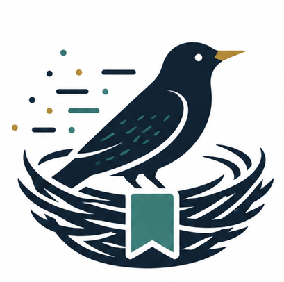

# Starling

[中文文档](README.zh-CN.md)

<p align="center">
  
</p>

Agent session manager for Claude Code and OpenAI Codex. Starling discovers local agent sessions, groups them by project, organizes them into hierarchical catalogs, monitors live agent state, and exposes fast CLI workflows for browsing, resuming, launching, and managing sessions.

Current release: **0.1.3**

- npm: [`starling-ai`](https://www.npmjs.com/package/starling-ai)
- GitHub Release: [`rust-v0.1.3`](https://github.com/huang-sh/Starling/releases/tag/rust-v0.1.3)
- VS Code extension: [`huangsh.starling-ai`](https://marketplace.visualstudio.com/items?itemName=huangsh.starling-ai)

## Features

- Discover Claude Code and Codex sessions from local session files.
- Browse sessions by catalog, project, or recent activity.
- Create catalogs such as `paper-review`, with optional hierarchical paths when needed.
- Add session metadata, titles, tags, notes, and catalog assignments.
- Resume Claude Code and Codex sessions from one command.
- Track token usage when it is available in the session file.
- Maintain a local session index at `~/.starling/session-index.json` for faster project and catalog views.
- Launch Claude Code or Codex through `starling run` and automatically assign the created session to a catalog.
- Manage Claude and Codex model profiles under `~/.starling/settings`.
- Monitor pinned sessions with a top-style terminal view that separates `running`, `waiting`, `idle`, and `stopped` states.
- Use JSON output as the stable data contract for terminal rendering and the VS Code extension.
- Use the separate VS Code extension for Catalog, Projects, Models, and Monitor.

## Installation

```bash
npm install -g starling-ai
```

The npm package is named `starling-ai`, but the installed command is:

```bash
starling --help
```

On Linux and macOS, npm installs the small JavaScript launcher plus the matching native package for your platform:

- `starling-linux-x64`
- `starling-darwin-x64`
- `starling-darwin-arm64`

The same native archives and sha256 files are attached to the GitHub release:

```text
https://github.com/huang-sh/Starling/releases/tag/rust-v0.1.3
```

The npm install step also installs the bundled Starling skill to:

```text
~/.codex/skills/starling/SKILL.md
~/.claude/skills/starling/SKILL.md
```

If npm lifecycle scripts were disabled with `--ignore-scripts`, install the skill manually from the package directory:

```bash
npm explore -g starling-ai -- npm run install:skill
```

Starling requires Node.js 16 or newer. Claude Code and/or Codex must be installed separately if you want Starling to discover, launch, or resume those agents.

## Quick Start

List recent sessions:

```bash
starling session ls
```

Show session details, including catalog metadata and token usage:

```bash
starling session show <session-id>
```

Resume a session:

```bash
starling resume <session-id>
```

Monitor pinned sessions:

```bash
starling top
starling top --watch
starling top --recent
starling top --json
```

Create a catalog and add a session:

```bash
starling catalog create paper-review
starling catalog add paper-review <session-id> --title "Figure review"
```

Launch Codex and assign the new session to a catalog:

```bash
starling run -c paper-review codex
```

Launch Claude Code with a Starling config profile:

```bash
starling run --setting ds -c paper-review claude
```

Starling options must be placed before the agent name. `-s` is the short alias for `--setting`; `-c` is the short alias for `--catalog`. Everything after `claude` or `codex` is passed directly to that agent:

```bash
starling run --catalog paper-review codex exec "summarize this repo"
starling run --catalog paper-review claude --dangerously-skip-permissions
```

Show Starling run records:

```bash
starling run status
```

## Commands

### Sessions

```bash
starling session ls
starling session ls --all
starling session ls --agent claude
starling session ls --cataloged
starling session ls --catalog paper-review
starling session show <session-id>
starling session resume <session-id>
starling session meta <session-id> --title "New title" --tags review,important
starling session note <session-id> "Follow up on benchmark results"
starling session unpin <session-id>
starling session delete <session-id> --yes
```

`starling ses` is an alias for `starling session`.

Catalog assignment can also be managed from the session namespace:

```bash
starling session catalog add <session-id> paper-review --title "Important run"
starling session catalog remove <session-id> paper-review
starling session catalog clear <session-id>
```

### Catalogs

```bash
starling catalog create <name>
starling catalog create parent/child/grandchild
starling catalog create child --parent parent
starling catalog ls
starling catalog tree
starling catalog tree --sessions
starling catalog show <catalog>
starling catalog add <catalog> <session-id>
starling catalog detach <catalog> <session-id>
starling catalog clear <catalog>
starling catalog delete <catalog>
starling catalog del <catalog>
starling catalog rename <catalog> <new-name>
starling catalog move <catalog> --parent <parent-catalog>
starling catalog move <catalog> --root
starling catalog edit <catalog> --rename <new-name>
starling catalog edit <catalog> --parent <parent-catalog>
starling catalog edit <catalog> --root
starling catalog tag <catalog> tag1 tag2
```

`starling cat` is an alias for `starling catalog`.

Catalog names may repeat when they live under different parents. Use a path such as `parent/child` or a catalog ID when a name is ambiguous.

### Projects

```bash
starling project ls
starling project ls --all
starling project ls --agent codex
starling project show /path/to/project
```

`starling prj` is an alias for `starling project`.

Project commands use the local session index by default. Rebuild or bypass it when needed:

```bash
starling session index status
starling session index rebuild
starling session index clear
starling project ls --refresh-index
starling project ls --no-index
```

### Top

`starling top` is the live session monitor. By default it shows pinned sessions and sorts them by session state:

1. `running`: the agent is actively processing work.
2. `waiting`: the agent is waiting for user input or approval.
3. `idle`: the agent process exists, but the model is not currently processing.
4. `stopped`: no active process is associated with the session.

```bash
starling top
starling top --watch
starling top --recent
starling top --catalog paper-review
starling top paper-review
starling top --json
```

The default terminal view is rendered by the npm CLI wrapper from JSON emitted by the Rust core. `--json` returns the raw monitor snapshot for scripts, the VS Code extension, or other frontends.

### Run Records

`starling run` launches agents under Starling tracking. The run record is separate from session state:

```bash
starling run --setting glm-5.2 --catalog research/paper claude
starling run --setting gpt-5.5 --catalog research/paper codex
starling run status
starling run stop <run-id>
```

Use `starling top` for current session state, and `starling run status` for launch/run history.

### Model Profiles

Model profiles are stored under:

```text
~/.starling/settings/claude
~/.starling/settings/codex
```

List current and Starling-managed profiles:

```bash
starling model ls
starling model ls --agent claude
starling model ls --agent codex
```

Create a Claude profile:

```bash
starling model add ds --agent claude \
  --model deepseek-v4-pro \
  --base-url https://api.example.com \
  --api-key "$API_KEY"
```

Create a Codex profile:

```bash
starling model add demo --agent codex \
  --model gpt-5.2 \
  --base-url https://api.example.com/v1 \
  --api-key "$OPENAI_API_KEY" \
  --reasoning high \
  --wire-api responses

starling model delete demo --agent codex
```

Use a profile when launching an agent:

```bash
starling run --setting demo --catalog paper-review codex
starling run --setting ds --catalog paper-review claude
```

If `--setting` is not provided, Starling uses the agent's normal default configuration.

## Configuration Files

Starling stores its own data in `~/.starling` by default:

```text
~/.starling/
  store.json
  session-index.json
  settings/
    claude/
      <profile>.json
    codex/
      <profile>.toml
```

Set `STARLING_HOME` to use a different Starling data directory:

```bash
STARLING_HOME=/data20T/dev/.starling starling project ls
```

Or persist the default Starling data directory with the CLI:

```bash
starling config set home /data20T/dev/.starling --migrate
starling config show
```

`STARLING_HOME` still has the highest priority and overrides the saved CLI setting for that process.

Starling does not move or rewrite the original Claude Code and Codex session files. It reads them from the agent-owned locations, such as `~/.claude/projects` and `~/.codex/sessions`, and stores only Starling metadata and profiles under the Starling data directory.

The local session index is optimized for repeated CLI and VS Code sidebar reads:

- `sessions`: parsed session metadata used by session, catalog, and project views.
- `files`: the indexed session file path and mtime, used to refresh only changed files.
- `directories`: scanned session directories and mtimes, used to discover newly created session files without reparsing everything.
- `projects`: precomputed project summaries for fast project tree/list rendering.

Project and catalog views refresh this index incrementally by default. The hot path discovers newly created session files from directory mtimes without statting every old session file. Exact session detail paths, such as `starling session show <session-id>`, refresh only the matched session file when needed. Use `starling session index rebuild` only when you want a full rescan.

See [docs/data-path-design.md](docs/data-path-design.md) for the full data path and index refresh design.

## Machine-Readable Output

Most Starling read commands support `--json`. The Rust core is responsible for discovery, indexing, metadata, live state, and JSON output. The npm wrapper renders terminal tables and top-style displays from the same JSON that the VS Code extension consumes.

Useful JSON entry points:

```bash
starling session ls --json
starling catalog list --json --pins
starling project ls --json
starling model ls --json
starling top --json
starling run status --json
```

Claude profiles are JSON files that Starling passes to Claude Code as settings.

Codex profiles are Codex-style TOML files. Starling copies them into a temporary Codex profile for the run, so `starling run --setting <name> codex` does not overwrite the user's default `~/.codex/config.toml`.

Example Codex profile:

```toml
model_provider = "custom"
model = "gpt-5.2"
model_reasoning_effort = "high"
disable_response_storage = true

[model_providers.custom]
name = "custom"
base_url = "https://api.example.com/v1"
wire_api = "responses"
requires_openai_auth = true
experimental_bearer_token = "sk-..."
```

For Chat Completions-only providers, add `api_format = "openai_chat"` to the profile.

## VS Code Extension

The VS Code extension is maintained separately at:

```text
https://github.com/huang-sh/Starling-ext
```

The Starling sidebar contains four views:

- Catalog: hierarchical catalog tree, with sessions shown on request.
- Projects: project directory tree with session counts.
- Models: Claude and Codex model profile settings.
- Monitor: pinned, active, and recent sessions with live status, context, token, CPU, memory, task, and PID details.

The extension supports common right-click actions:

- Resume session.
- Show session details.
- Pin to catalog.
- Remove pin metadata.
- Delete session.
- Open project in a new VS Code window.
- Copy project path.
- Copy session ID.

The extension calls the `starling` CLI. If VS Code cannot find it on `PATH`, set `starling.cliPath` to an absolute path in VS Code settings. To use a different Starling data directory, set `starling.homePath`; the extension passes it to the CLI as `STARLING_HOME`.

Useful extension settings:

```json
{
  "starling.cliPath": "starling",
  "starling.homePath": "",
  "starling.cacheTtlSeconds": 30,
  "starling.monitorRefreshSeconds": 3,
  "starling.monitorCacheTtlSeconds": 2,
  "starling.projectSessionLimit": 30,
  "starling.sessionTreeLimit": 50
}
```

Extension logs are written to the VS Code **Output** panel under `Starling`. CLI and monitor refresh failures are also surfaced through VS Code **Problems** diagnostics when applicable.

## Development

```bash
npm install
npm run build
npm run lint
npm test
```

Build the CLI into `dist/index.js`:

```bash
npm run build
```

Run locally from the repository:

```bash
node dist/index.js --help
```

## License

MIT
