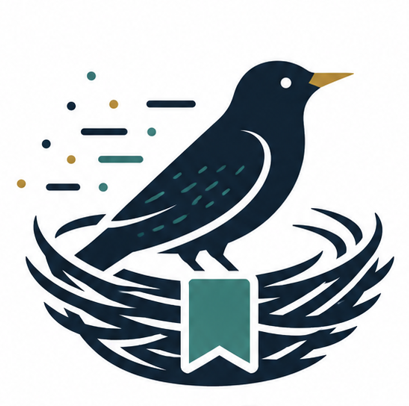

<p align="center">
  English | <a href="README.zh-CN.md">简体中文</a>
</p>

# Starling

<p align="center">
  
</p>

Launch, switch, and organize Claude Code, Codex, and Pi sessions with model profiles, catalogs, project views, live monitoring, and VS Code integration.

Current release: **0.2.1**

- npm: [`starling-ai`](https://www.npmjs.com/package/starling-ai)
- GitHub Release: [`rust-v0.2.1`](https://github.com/huang-sh/Starling/releases/tag/rust-v0.2.1)
- VS Code extension: [`huangsh.starling-ai`](https://marketplace.visualstudio.com/items?itemName=huangsh.starling-ai)

## Features

- Discover Claude Code, Codex, and Pi sessions from local session files.
- Browse sessions by catalog, project, or recent activity.
- Create catalogs such as `paper-review`, with optional hierarchical paths when needed.
- Add session metadata, titles, tags, notes, and catalog assignments.
- Resume Claude Code, Codex, and Pi sessions from one command.
- Track token usage when it is available in the session file.
- Maintain a local session index at `~/.starling/session-index.json` for faster project and catalog views.
- Launch Claude Code, Codex, or Pi through `starling run` and automatically assign the created session to a catalog.
- Run `starling` with no subcommand to open Starling's own full-screen coding workspace, backed directly by the Pi SDK.
- Host the same SDK session as a machine-readable JSONL process through `starling chat pi` for editor integrations.
- Manage Claude, Codex, and Pi model profiles under `~/.starling/settings`.
- Monitor the top 20 active pinned and unpinned sessions together with a top-style terminal view that separates `running`, `waiting`, `idle`, and `stopped` states.
- Use JSON output as the stable data contract for terminal rendering and the VS Code extension.
- Use the separate VS Code extension for Catalog, Projects, Models, and Monitor.

## Installation

```bash
npm install -g starling-ai
```

The npm package is named `starling-ai`, but the installed command is:

```bash
starling --help
```

On Linux and macOS, npm installs the small JavaScript launcher plus the matching native package for your platform:

- `starling-linux-x64` for glibc Linux x64
- `starling-linux-x64-musl` for musl/Alpine Linux x64
- `starling-linux-arm64` for glibc Linux arm64
- `starling-darwin-x64`
- `starling-darwin-arm64`

GNU Linux packages are built against a GLIBC 2.31 baseline and the x64 binary is smoke-tested on Ubuntu 20.04 before publication. Use the x64 musl archive on Alpine or another musl-based distribution.

The same native archives and sha256 files are attached to the GitHub release:

```text
https://github.com/huang-sh/Starling/releases/tag/rust-v0.2.1
```

The npm install step also installs the bundled Starling skill to:

```text
~/.codex/skills/starling/SKILL.md
~/.claude/skills/starling/SKILL.md
~/.pi/agent/skills/starling/SKILL.md
```

If npm lifecycle scripts were disabled with `--ignore-scripts`, install the skill manually from the package directory:

```bash
npm explore -g starling-ai -- npm run install:skill
```

The npm distribution requires Node.js 22.19.0 or newer and installs `@earendil-works/pi-coding-agent` 0.82.0 as a fixed dependency. Starling imports its public SDK only when starting the chat workspace; session-management commands do not initialize the SDK. `starling run pi` remains a compatibility path for launching Pi's native CLI, while bare `starling` and `starling chat pi` use the Starling-owned SDK host.

## Quick Start

Open a new SDK-backed coding session in the current directory:

```bash
starling
```

This starts Starling's own TUI. It does not start or copy Pi's interactive TUI.

List recent sessions:

```bash
starling session ls
```

Show session details, including catalog metadata and token usage:

```bash
starling session show <session-id>
```

Resume a session:

```bash
starling resume <session-id>
```

Monitor live sessions:

```bash
starling top
starling top --watch
starling top --pinned
starling top --json
```

Create a catalog and add a session:

```bash
starling catalog create paper-review
starling catalog add paper-review <session-id> --title "Figure review"
```

Launch Codex and assign the new session to a catalog:

```bash
starling run -c paper-review codex
```

Launch Claude Code with a Starling config profile:

```bash
starling run --setting ds -c paper-review claude
```

Launch Pi and assign the new session to a catalog:

```bash
starling run -c paper-review pi
```

A plain `starling run pi` does not add a session selector. Pi creates the new session ID normally, and the Starling runtime hook records that ID after startup.

Start the SDK host for VS Code or another machine client:

```bash
starling chat --cwd /path/to/project --title "Review" pi
starling chat --cwd /path/to/project pi --session /absolute/path/to/session.jsonl
```

`starling chat pi` starts Starling's Node host, which imports `createAgentSession`, `ModelRuntime`, `SessionManager`, and `DefaultResourceLoader` from the Pi SDK. It never launches `pi --mode rpc`. A new chat lets `SessionManager.create()` allocate the session identity and receives no preallocated `--session-id`; `--session` accepts only an absolute existing Pi transcript path. Standard input and SDK events use newline-delimited JSON. Standard output contains only LF-terminated JSON records: Starling brackets the compatibility records with `starling_started` and `starling_exited` events whose `schema` is `starling.chat` and `schemaVersion` is `1`. Diagnostics are written to standard error.

The chat runtime disables discovered user/project Pi extensions and explicitly loads only Starling's runtime gate. It auto-allows the built-in read-only `read`, `grep`, `find`, and `ls` tools. `bash`, `edit`, `write`, and unknown tools issue Pi `extension_ui_request` confirmation events. The RPC client must answer those requests; rejection, cancellation, UI errors, or no response within 30 seconds block the tool call. Ordinary interactive `starling run pi` permission behavior is unchanged.

Starling options must be placed before the agent name. `-s` is the short alias for `--setting`; `-c` is the short alias for `--catalog`. Agent arguments go after `claude`, `codex`, or `pi`. Starling may add its runtime hook and pin an explicit existing-session selector to the locked transcript path:

```bash
starling run --catalog paper-review codex exec "summarize this repo"
starling run --catalog paper-review claude --dangerously-skip-permissions
starling run --catalog paper-review pi --provider anthropic --model claude-sonnet-4-5
```

Pi does not expose a built-in MCP configuration contract. Starling's `--mcp` and `--mcp-profile` options are not supported for Pi; use a Pi extension when MCP integration is required.

Show Starling run records:

```bash
starling run status
```

## Commands

### Sessions

```bash
starling session ls
starling session ls --all
starling session ls --agent claude
starling session ls --agent pi
starling session ls --cataloged
starling session ls --catalog paper-review
starling session show <session-id>
starling session resume <session-id>
starling session meta <session-id> --title "New title" --tags review,important
starling session note <session-id> "Follow up on benchmark results"
starling session unpin <session-id>
starling session delete <session-id> --yes
```

`starling ses` is an alias for `starling session`.

Starling resumes Pi sessions with `pi --session <absolute-jsonl-path>`. Because Pi IDs are scoped to a cwd, Starling reports an ambiguity instead of choosing the wrong project when an ID is reused. Pass the absolute JSONL path to `starling resume` to disambiguate. Custom Pi session IDs remain case-sensitive in Starling lookups.

`starling run pi --continue` resolves and locks the current project's latest transcript before launch, then pins the launch to its absolute path. If the project has no transcript yet, Starling preserves Pi's create-new fallback with a preallocated, locked session ID. Pi's interactive `--resume` picker cannot be locked before the user selects a transcript, so managed `starling run pi --resume` is rejected; use `starling resume <session-id-or-absolute-path>` instead. For the same reason, managed Pi runs block in-process `/new`, `/resume`, and `/fork`; exit Pi before starting or resuming another managed session.

For an explicit `starling run pi --session <path>`, the path must already be a non-empty, valid Pi transcript (legacy v1/v2 transcripts are accepted and Pi may migrate them). Native Pi can initialize a missing or zero-byte explicit path, but Starling rejects that case because no session ID exists to lock before spawn. Use `starling run pi --session-id <id>` for a safely locked new managed session, or initialize the exact path once with Pi directly and then resume it through Starling.

On Linux, Pi replaces its process command line with the title `pi` after startup. Live mapping of Pi processes launched outside Starling therefore cannot reliably recover one-shot `--session` or `--session-dir` values after startup. Managed launches carry explicit hook/environment identity; for reliable monitoring of an external custom root, configure it persistently with `PI_CODING_AGENT_SESSION_DIR` or `settings.json`.

Catalog assignment can also be managed from the session namespace:

```bash
starling session catalog add <session-id> paper-review --title "Important run"
starling session catalog remove <session-id> paper-review
starling session catalog clear <session-id>
```

### Catalogs

```bash
starling catalog create <name>
starling catalog create parent/child/grandchild
starling catalog create child --parent parent
starling catalog ls
starling catalog tree
starling catalog tree --sessions
starling catalog show <catalog>
starling catalog add <catalog> <session-id>
starling catalog detach <catalog> <session-id>
starling catalog clear <catalog>
starling catalog delete <catalog>
starling catalog del <catalog>
starling catalog rename <catalog> <new-name>
starling catalog move <catalog> --parent <parent-catalog>
starling catalog move <catalog> --root
starling catalog edit <catalog> --rename <new-name>
starling catalog edit <catalog> --parent <parent-catalog>
starling catalog edit <catalog> --root
starling catalog tag <catalog> tag1 tag2
```

`starling cat` is an alias for `starling catalog`.

Catalog names may repeat when they live under different parents. Use a path such as `parent/child` or a catalog ID when a name is ambiguous.

### Projects

```bash
starling project ls
starling project ls --all
starling project ls --agent codex
starling project ls --agent pi
starling project show /path/to/project
```

`starling prj` is an alias for `starling project`.

Project commands use the local session index by default. Rebuild or bypass it when needed:

```bash
starling session index status
starling session index rebuild
starling session index clear
starling project ls --refresh-index
starling project ls --no-index
```

### Top

`starling top` is the live session monitor. By default it mixes pinned and unpinned sessions and shows the top 20 by activity:

1. `running`: the agent is actively processing work.
2. `waiting`: the agent is waiting for user input or approval.
3. `idle`: the agent process exists, but the model is not currently processing.
4. `stopped`: no active process is associated with the session.

```bash
starling top
starling top --watch
starling top --pinned
starling top --limit 40
starling top --agent codex
starling top --agent claude --sort cpu
starling top --agent pi
starling top --sort tokens
starling top --sort cpu
starling top --catalog paper-review
starling top paper-review
starling top --json
```

Agent filters: `--agent claude`, `--agent codex`, or `--agent pi`.

Sort modes: `activity` (default), `recent`, `tokens`, `created`, `memory`, `cpu`, `ctx`, `skills`, and `tools`.

The default terminal view is rendered by the npm CLI wrapper from JSON emitted by the Rust core. `--json` returns the raw monitor snapshot for scripts, the VS Code extension, or other frontends.

### Run Records

`starling run` launches agents under Starling tracking. The run record is separate from session state:

```bash
starling run --setting glm-5.2 --catalog research/paper claude
starling run --setting gpt-5.5 --catalog research/paper codex
starling run --catalog research/paper pi
starling run status
starling run stop <run-id>
```

Use `starling top` for current session state, and `starling run status` for launch/run history.

### Model Profiles

Model profiles are stored under:

```text
~/.starling/settings/claude
~/.starling/settings/codex
~/.starling/settings/pi
```

List current and Starling-managed profiles:

```bash
starling model ls
starling model ls --agent claude
starling model ls --agent codex
starling model ls --agent pi
```

Create a Claude profile:

```bash
starling model add ds --agent claude \
  --model deepseek-v4-pro \
  --base-url https://api.example.com \
  --api-key "$API_KEY"
```

Create a Codex profile:

```bash
starling model add demo --agent codex \
  --model gpt-5.2 \
  --base-url https://api.example.com/v1 \
  --api-key "$OPENAI_API_KEY" \
  --reasoning high \
  --wire-api responses

starling model delete demo --agent codex
```

Create a Pi profile as `~/.starling/settings/pi/research.json`:

```json
{
  "provider": "anthropic",
  "model": "claude-sonnet-4-5",
  "thinking": "high"
}
```

Pi authentication remains in Pi-owned auth/config files such as `~/.pi/agent/auth.json` and `~/.pi/agent/models.json`, or in provider environment variables. Do not put credentials in a Starling Pi profile.

```bash
starling model delete research --agent pi
```

Use a profile when launching an agent:

```bash
starling run --setting demo --catalog paper-review codex
starling run --setting ds --catalog paper-review claude
starling run --setting research --catalog paper-review pi
```

If `--setting` is not provided, Starling uses the agent's normal default configuration.

## Configuration Files

Starling stores its own data in `~/.starling` by default:

```text
~/.starling/
  store.json
  session-index.json
  settings/
    claude/
      <profile>.json
    codex/
      <profile>.toml
    pi/
      <profile>.json
```

Set `STARLING_HOME` to use a different Starling data directory:

```bash
STARLING_HOME=/data20T/dev/.starling starling project ls
```

Or persist the default Starling data directory with the CLI:

```bash
starling config set home /data20T/dev/.starling --migrate
starling config show
```

`STARLING_HOME` still has the highest priority and overrides the saved CLI setting for that process.

Starling resolves the Pi executable in this order: `STARLING_PI_BIN`, saved `piPath`, `STARLING_BUNDLED_PI_BIN` (set by the npm launcher), then `pi` on `PATH`. Configure or inspect it with:

```bash
starling config set pi /absolute/path/to/pi
starling config unset pi
starling config show
```

The npm launcher exposes Starling's SDK host as `STARLING_PI_SDK_HOST` and its compatible Node executable as `STARLING_PI_SDK_NODE`. When invoked through that npm launcher, Starling uses the pair for the bare TUI and `starling chat pi`; it does not resolve or execute the Pi CLI for those paths. The standalone native binary still uses the explicit `starling chat pi` subcommand and requires those two environment variables. Separately, the launcher can still resolve the package's public `rpc-entry` export and expose `cli.js` as `STARLING_BUNDLED_PI_BIN` for the legacy `starling run pi` command. Explicit `STARLING_PI_BIN` or `STARLING_BUNDLED_PI_BIN` values are never overwritten.

Starling does not move or rewrite the original Claude Code, Codex, or Pi session files. It reads them from agent-owned locations such as `~/.claude/projects`, `~/.codex/sessions`, and `~/.pi/agent/sessions`, and stores only Starling metadata and profiles under the Starling data directory. Starling honors Pi's `PI_CODING_AGENT_DIR`, `PI_CODING_AGENT_SESSION_DIR`, global `settings.json`, and project-local `<cwd>/.pi/settings.json` `sessionDir` settings when the launch cwd is known.

The local session index is optimized for repeated CLI and VS Code sidebar reads:

- `sessions`: parsed session metadata used by session, catalog, and project views.
- `files`: the indexed session file path and mtime, used to refresh only changed files.
- `directories`: scanned session directories and mtimes, used to discover newly created session files without reparsing everything.
- `projects`: precomputed project summaries for fast project tree/list rendering.

Project and catalog views refresh this index incrementally by default. The hot path discovers newly created session files from directory mtimes without statting every old session file. Exact session detail paths, such as `starling session show <session-id>`, refresh only the matched session file when needed. Use `starling session index rebuild` only when you want a full rescan.

See [docs/data-path-design.md](docs/data-path-design.md) for the full data path and index refresh design.

## Machine-Readable Output

Most Starling read commands support `--json`. The Rust core is responsible for discovery, indexing, metadata, live state, and JSON output. The npm wrapper renders terminal tables and top-style displays from the same JSON that the VS Code extension consumes.

Useful JSON entry points:

```bash
starling session ls --json
starling catalog list --json --pins
starling project ls --json
starling model ls --json
starling top --json
starling run status --json
```

Claude profiles are JSON files that Starling passes to Claude Code as settings.

Codex profiles are Codex-style TOML files. Starling copies them into a temporary Codex profile for the run, so `starling run --setting <name> codex` does not overwrite the user's default `~/.codex/config.toml`.

Pi profiles are JSON files with `provider`, `model`, and optional `thinking` fields. Starling translates them to Pi's `--provider`, `--model`, and `--thinking` arguments for that run without overwriting Pi's global `~/.pi/agent/settings.json`.

Example Codex profile:

```toml
model_provider = "custom"
model = "gpt-5.2"
model_reasoning_effort = "high"
disable_response_storage = true

[model_providers.custom]
name = "custom"
base_url = "https://api.example.com/v1"
wire_api = "responses"
requires_openai_auth = true
experimental_bearer_token = "sk-..."
```

For Chat Completions-only providers, add `api_format = "openai_chat"` to the profile.

## VS Code Extension

The VS Code extension is maintained separately at:

```text
https://github.com/huang-sh/Starling-ext
```

The extension contributes a Starling Chat workspace to VS Code's right sidebar and keeps four management views in the activity bar:

- Catalog: hierarchical catalog tree, with sessions shown on request.
- Projects: project directory tree with session counts.
- Models: Claude, Codex, and Pi model profile settings.
- Monitor: pinned and unpinned sessions together with live status, context, token, CPU, memory, task, and PID details.
- Starling Chat: an SDK-backed streaming conversation with tool activity and native permission dialogs.

The extension supports common right-click actions:

- Resume session.
- Show session details.
- Pin to catalog.
- Remove pin metadata.
- Delete session.
- Open project in a new VS Code window.
- Copy project path.
- Copy session ID.

The extension calls the `starling` CLI. If VS Code cannot find it on `PATH`, set `starling.cliPath` to an absolute path in VS Code settings. To use a different Starling data directory, set `starling.homePath`; the extension passes it to the CLI as `STARLING_HOME`.

Useful extension settings:

```json
{
  "starling.cliPath": "starling",
  "starling.homePath": "",
  "starling.cacheTtlSeconds": 30,
  "starling.monitorRefreshSeconds": 3,
  "starling.monitorCacheTtlSeconds": 2,
  "starling.projectSessionLimit": 30,
  "starling.sessionTreeLimit": 50
}
```

Extension logs are written to the VS Code **Output** panel under `Starling`. CLI and monitor refresh failures are also surfaced through VS Code **Problems** diagnostics when applicable.

## Development

```bash
npm install
npm run build
npm run lint
npm test
```

Build the CLI into `dist/index.js`:

```bash
npm run build
```

Run locally from the repository:

```bash
node dist/index.js --help
```

## License

MIT
